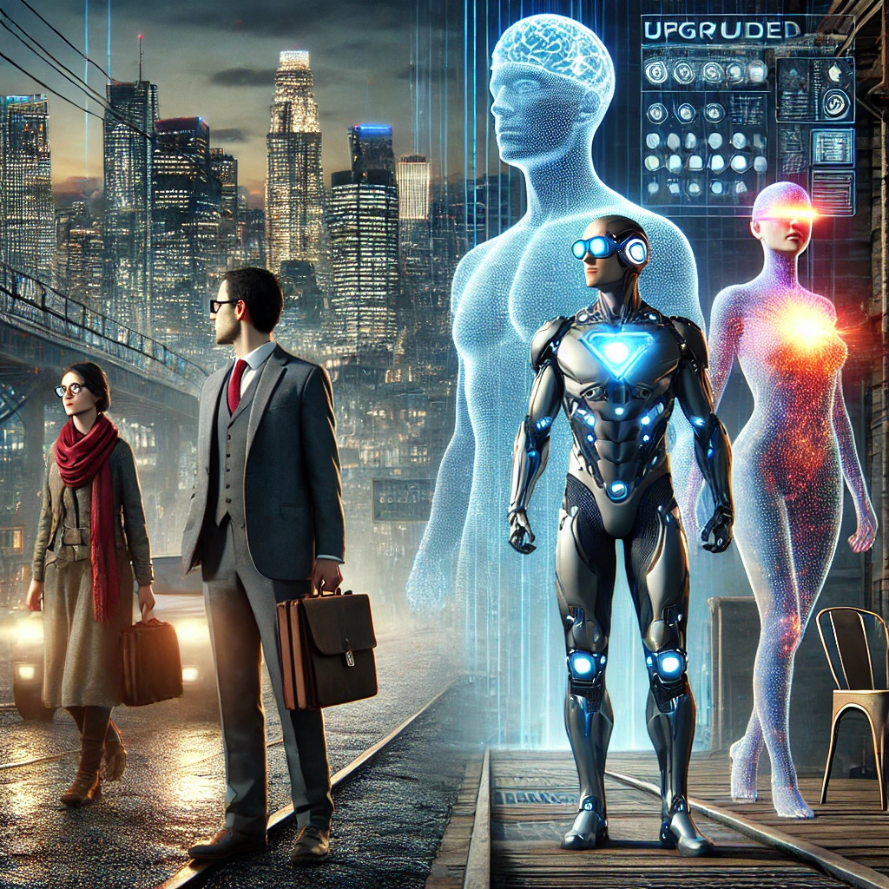
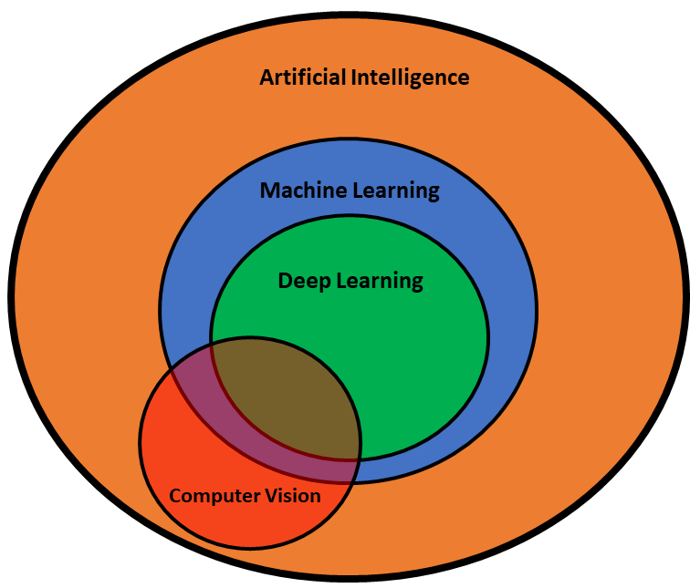
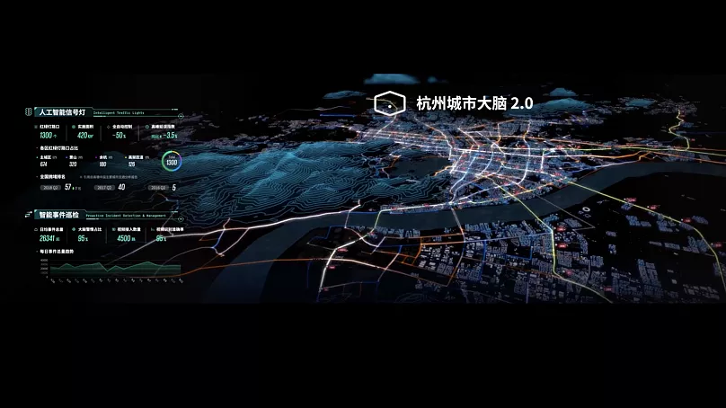

<!-- Title -->
# Fundamentals of Image Processing (Computer Vision)
<!-- For non-techies -->

<!-- Author -->
**Javad Amirian**  
*Dec 2024*


<!-- Slide -->
## Context
<!-- Start with an intresting fact -->
- Job market shift in the digital age.
- Share of technology in the economy:
    * The digital economy accounts for 10% of GDP in the United States (2022).

<!-- Slide -->
## Dark Side of the Future
<!-- quotation -->

<!-- Yuval Noah Harari in his book "Homo Deus" imagines a future where:
> "(by 2070) some elites conclude that there is no point in providing improved or even standard levels of health for masses of useless poor people, and it is far more sensible to focus on upgrading a handful of superhumans beyond the norm." - Yuval Noah Harari   -->

> In Homo Deus, Yuval Noah Harari envisions a future (by 2070) where technological advancements, such as brain-computer interfaces, create a class of enhanced superhumans. This elite dominates society, leading to unprecedented inequality and a significant societal divide between the augmented and unaugmented populations

(Homo Deus: A Brief History of Tomorrow) 
// Ensane Khoda Gooneh 


* Now, imagine we already witness technologies like Neuralink (implantable, brain-computer interface capable of translating thought into action) (GPT5) and also AR / Smart glasses which are equipped with dozen of cameras and can process everything we see.

// image of Neuralink + AR / Smart Glasses 

<!-- Slide -->
## Big Picture (AI)
Where is computer vision?

<!-- TODO -->
* AI: The 
* Machine Learning: Teaching machines
* Deep Learning: Using (Deep) Neural Networks to 
* Computer vision: ...



# Basics
What is Image Processing 
- Input → Process → Output

- **Input**: Digital Image
- **Process**: Extracting features from the image
- **Output**: Information about the image

#### From Image Processing to Image Understanding
<!-- **Image Processing ≠ Computer Vision** -->
* Make a few examples of most fundamental image processing algorithms
  <!-- TODO -->
    * Edge Detection
    * 
    * ...   <!-- some other basic algorithms -->


# Use Cases

### Object Detection
* What is object detection

1. **Template Matching** (Simplest)
- Ex: Finding a logo in an image
- How it works: Slide a template image over the input image and compare pixel values
- Limitation: Sensitive to rotation, scaling, and lighting changes


###
2- Optical Character Recognition (OCR)
* How OCR works: Detects text in images and classify each character
* It also requires character "segmentation": breaking down the image into individual characters, using edge detection and other techniques

- Ex: License Plate Recognition is one of the most practical applications of computer vision. For automated parkings, toll booths, and traffic monitoring. 

###
3- Object Tracking
* What is object tracking:
  - the problem of tracking object locations in a video sequence
  - mathematically, you can do this by re-detecting the object in new frames and matching it with the previous frame
  - it's a challenging problem due to occlusions, object deformations, etc.
- Ex: Traffic Monitoring: This is one of the most transformative applications of computer vision. 

###
Case Study: Alibaba City Brain project (Hangzhou)
Tech: Processing 4,000 intersection cameras to monitor traffic in real-time
Impact:
-  Reduced the city's ranking in congestion from 5th to 57th in China
-  Improved traffic speed by 15% in some areas
-  Shortened commute times for residents
-  Enabled emergency vehicles to reach their destinations 50% faster



### Neural Networks
A. Artifical Neurons:
- They are made up of neurons that have learnable weights and biases. Each neuron receives some inputs, performs a dot product, and optionally follows it with a non-linearity.
B. Convolutional Neural Networks (CNNs)
* How CNNs work: Use shared neurons to detect patterns in images.
They made a breakthrough in image recognition and revolutionized computer vision.


### Face Recognition:
  - Detecting and recognizing faces in images and videos
  - Requires the database of all the faces of people you want to recognize
  - In China, 700 million cameras are used for surveillance (one camera for every two citizens)
  
4- Human Pose Estimation
- It's the problem of detecting the locations of key body parts in an image
<!-- Matching to a predefined skeleton of the object -->
- A predefined skeleton of the body is used to match the detected keypoints

- Use Cases: Sports Analytics, Security and Surveillance, Animation & Gaming.
- Challenges: Occlusions, 3D pose estimation, ...
  
### Human Activity Recognition
- Detecting and classifying human actions in videos
- Ex: fall detection for elderly people, terrorist activity detection, ...

- Use Case: Amazon Go 
(+ video)


### Image Segmentation 
- analyzing the image and decision making at pixel level
- more complicated than image classificaion and object detection
- Examples: Medical Imaging, 


Use Case: Cancer Detection
The main issue in cancer treatment is the late diagnosis of the disease.
Using computer vision you can train models to detect cancerous cells in medical images with quite high accuracy.
This can facilitates the mass scanning of citizens.


// in Agriculture
  - https://servirglobal.net/news/video-space-farm-using-satellites-map-crops-himalayas
  - https://youtu.be/3tkyp9zK0Os

- Aerial Photography
// in Military


### Robot Vision

- Even more challenging: 
  * Realtime processing on the edge
  * Responsible to navigate a robot
  

  1. Warehouse Robots
  For example Amazon utilizes 1000s of robots to manage its warehouses and automate the packaging and delivery pipelines
  
  2. Agricultural Robots
  For crop yielding, weed detection, and selective spraying
  -> 
   

### Self-driving Cars

- Several cameras and sensors are used to detect objects, lanes, and traffic signs
- The car should be able to make decisions based on the detected objects
- Challenges: Occlusions, weather conditions, ...


### Vision-Language-Action Models
- Combining computer vision with natural language processing to control robots
- For example the robot should understand the user command (e.g. "bring me a cup of coffee") and navigate to the kitchen, recognize the cup, and bring it back to the user
- Challenges: Understanding the context, ambiguity, ...


### Image Captioning
- Generating a textual description of an image
- It requires a model that can understand the content of the image and generate a human-like description
- Use Cases: Social Media, Image Search, ...


### Image/video Generation
GAN: Generative Adversarial Networks
- Two neural networks are trained simultaneously: a generator and a discriminator
- The generator creates new images, and the discriminator tries to distinguish between real and generated images
- The generator improves over time to generate more realistic images
- Use Cases: Deep Fakes, Content Creation, ...

// Obama deep fake example

- Generating images and videos from user prompts or uploaded images
- Use Cases: Content Creation, 
- Generative Models
// video generation examples


<!-- ## Case Studies
- Ship Detection in Satellite Images -->

# Tools and Libraries
Python:
- Most of the computer vision tasks can be done using Python language and its libraries
- It has a large community and many resources for computer vision
- It is very intuitive and easy to learn
- Easy to debug and test

C++/Rust:
- For more critical tasks, such as real-time processing on the edge, ...
- Faster than Python


## Google Lens
- Object Recognition: Google Lens can identify objects, plants, animals, and landmarks in images.
- Text Extraction (OCR): Extract and copy text from images or documents
- Translation: Translate text in images from one language to another
- Visual Search: Find similar images or products based on the uploaded image

Example:


## ChatGPT Vision
- You can now upload images to ChatGPT (or use the new vision capabilities) to get answers and generate creative content.
- Image Analysis: Analyze images to answer questions about their content.
- Image Generation: Generate images based on text prompts.

Example:


## OpenCV
- The most popular open-source computer vision library
- It has a large number of functions for image processing, object detection, and more

Example: edge detection (Canny)
```python

```

## YOLO (You Only Look Once)
- YOLO: A popular CNN model for fast object detection. 
- Fast and easy to use
- Fun fact: YOLO was originally developed by Ali Farhadi's team at the University of Washington, who was alumni of Shahid Beheshti University


Examples: detetcting cars in an image:
```python
...
```

### How to train a model
- Collect Data
- Annotate
- Train
- Validate
- Deploy


## Transformers Library (Hugging Face)
- Example: 

/ Matlab
<!-- - Google Lens -->
<!-- - ChatGPT Vision -->
- RoboFlow / Viso.ai
- Hugging Face
<!-- - OpenCV / SimpleCV -->
<!-- - YOLO -->


**The Future**
- Smart Glasses + Neuralink → Humans Augmented with Smart Glasses
- Autonomous Cars and Robots
- Cameras Everywhere
- Realtime Satellite Image Processing

---

**Thank You!**
