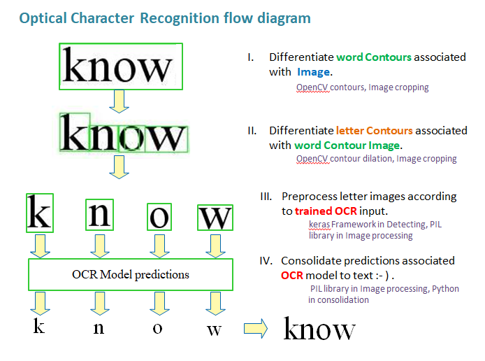
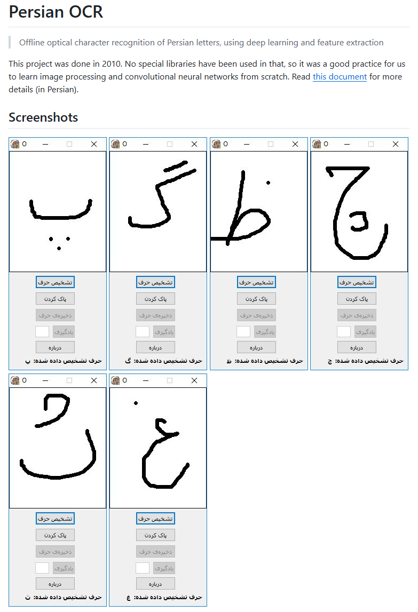
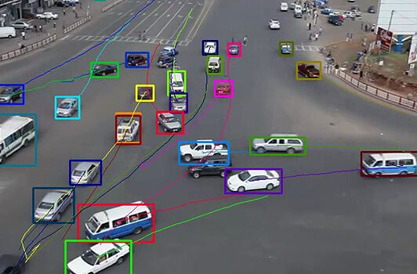
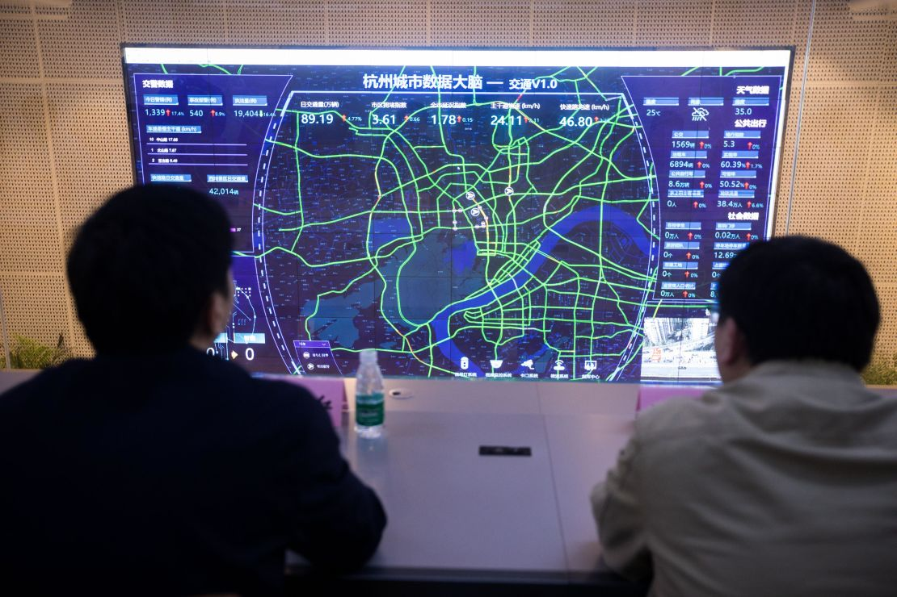
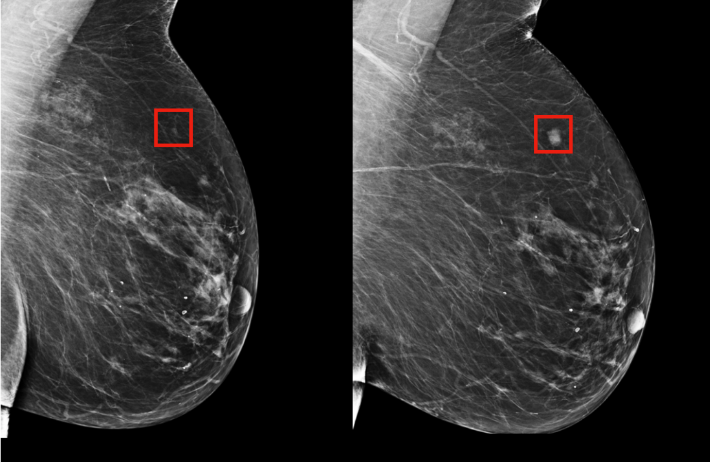
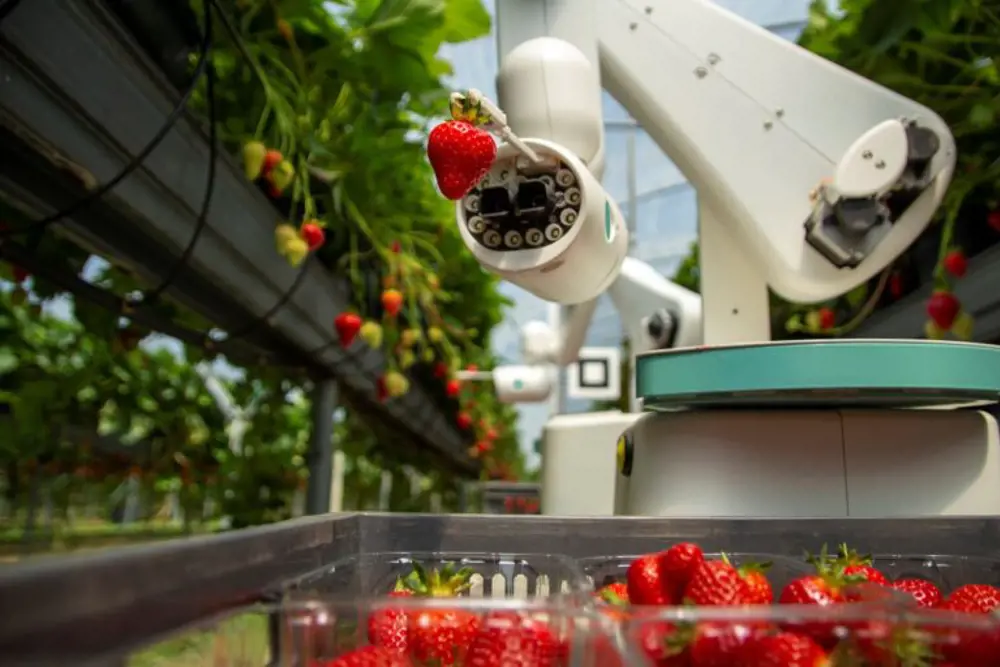
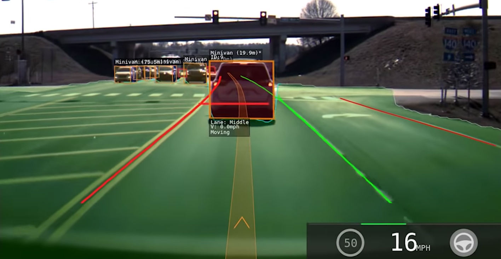
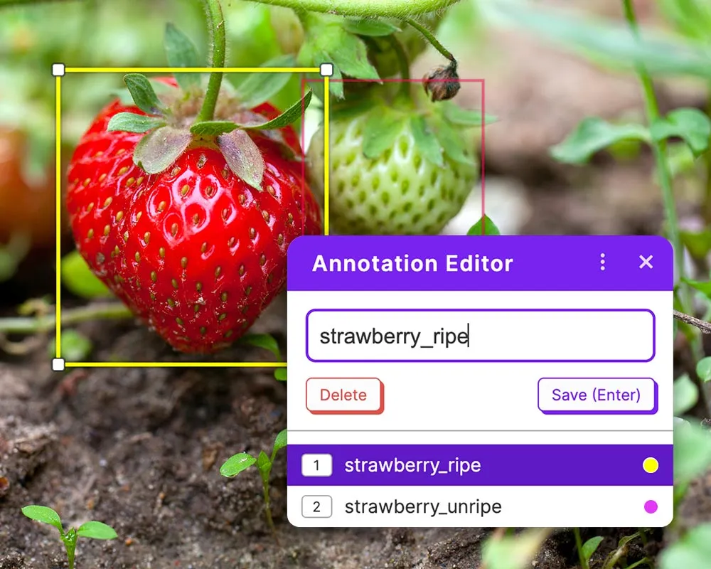
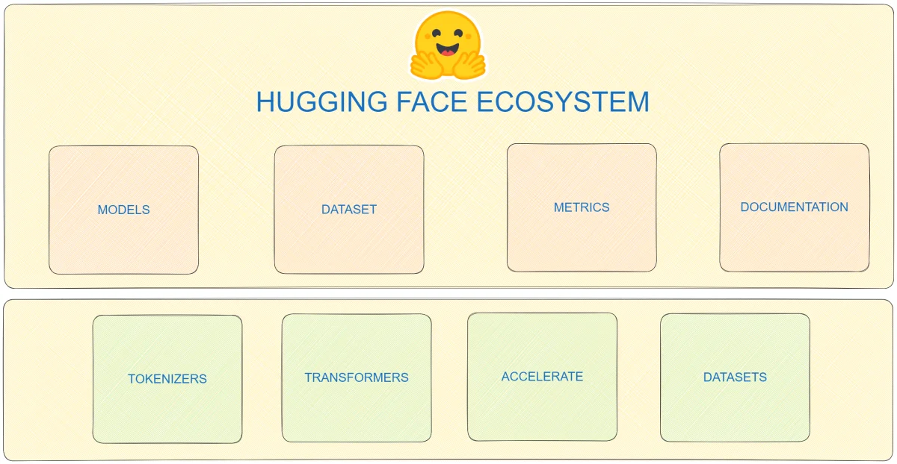

<!-- Title -->
# Fundamentals of Image Processing (Computer Vision)
<!-- For non-techies -->

<!-- Author -->
**Javad Amirian**  
*Dec 2024*


<!-- Slide -->
## Context
<!-- Start with an intresting fact -->
- Job market shift in the digital age: 
    * More than 65% of the today jobs didn't exist in 80 years ago.

- Share of technology in the economy:
    * The digital economy accounts for 10% of GDP in the United States (2022).

<!-- Slide -->
## Dark Side of the Future
<!-- quotation -->

<!-- Yuval Noah Harari in his book "Homo Deus" imagines a future where:
> "(by 2070) some elites conclude that there is no point in providing improved or even standard levels of health for masses of useless poor people, and it is far more sensible to focus on upgrading a handful of superhumans beyond the norm." - Yuval Noah Harari   -->

> In Homo Deus, Yuval Noah Harari envisions a future (by 2070) where technological advancements, such as brain-computer interfaces, create a class of enhanced superhumans. This elite dominates society, leading to unprecedented inequality and a significant societal divide between the augmented and unaugmented populations

(Homo Deus: A Brief History of Tomorrow) 
// Ensane Khoda Gooneh 


* Now, imagine we already witness technologies like Neuralink (implantable, brain-computer interface capable of translating thought into action) (GPT5) and also AR / Smart glasses which are equipped with dozen of cameras and can process everything we see.

// image of Neuralink + AR / Smart Glasses 

<!-- Slide -->
## Big Picture (AI)
<!-- Where is computer vision? -->

* **AI**: creating intelligent systems that can simulate human-like capabilities.
* **Machine Learning**: Teaching machines to learn patterns and make decisions from data.
* **Deep Learning**: Using (deep) neural networks to model and predict complex data relationships.
* **Computer vision**: Enabling machines to interpret and analyze visual information from the world.


# Basics
What is Image Processing 
- Input → Process → Output

- **Input**: Digital Image
- **Process**: Extracting features from the image
- **Output**: Information about the image

#### From Image Processing to Image Understanding
<!-- **Image Processing ≠ Computer Vision** -->
* Make a few examples of most fundamental image processing algorithms
  <!-- TODO -->
    * Edge Detection
    * 
    * ...   <!-- some other basic algorithms -->


# Use Cases

### Object Detection
- Definition: Detecting, classifying, and localizing objects in an image

- Simple Method: **Template Matching**
- Ex: Finding the yellow bird in the image!
- Algorithm: Slide the template image over the large image and compare the pixel values
- Limitation: Sensitive to rotation, scaling, and lighting changes


### Optical Character Recognition (OCR)
- **Definition**: Detect text in images and classify each character
- Use character "segmentation" to break down the image into individual characters, using edge detection and other techniques

- **Use Cases**: *License Plate Recognition* in automated parkings, toll booths, and traffic monitoring.. 




### Object Tracking
- **Definition**: tracking object locations in a video sequence
- **Theoretically**: by re-detecting the object in consequent frames and matching it with the previous frame
- **Challenges**: Occlusions, object deformations, etc.

- **Example**: *Traffic Monitoring* as one of the most transformative applications of computer vision. 



### Alibaba City Brain project (Hangzhou)
- **Tech**: Processing 4,000 intersection cameras to monitor traffic in real-time

**Impact**:
-  Reduced the city's ranking in congestion from 5th to 57th in China
-  Improved traffic speed by 15% in some areas
-  Shortened commute times for residents
-  Enabled emergency vehicles to reach their destinations 50% faster

<!--  -->


### Neural Networks
A. **Artifical Neurons**: Each neuron receives some inputs, performs a dot product, adds a bias, and optionally follows it with a non-linear function.
 
B. **Convolutional Neural Networks (CNNs)**: They use special layers called convolutional layers that share weights and learn filters to detect patterns in images.

* The introduction of CNNs revolutionized computer vision in 2012 when *AlexNet* won the *ImageNet* competition. Many computer vision tasks are now solved using CNNs.

### Data as the Fuel
- Neural networks and deep learning models require data to learn patterns 
- The more data you have, the better the model performs
- One of the main reasons for the success of deep learning in computer vision is the effort to collect and annotate large datasets

### Face Recognition:
  - **Definition**: Identifying or verifying people in images or videos
  - Requires the database of all the faces of people you want to recognize
  - **Example**: In China, 700 million cameras are used for surveillance (one camera for every two citizens)
  
### Human Pose Estimation
- **Definition**: problem of detecting the locations of key body parts in an image
<!-- Matching to a predefined skeleton of the object -->
- A predefined skeleton of the body is used to match the detected keypoints

- **Use Cases**: Sports Analytics, Security and Surveillance, Animation & Gaming.
- **Challenges**: Occlusions, 3D pose estimation, ...
  
### Human Activity Recognition
- Detecting and classifying human actions in videos
- **Example**: fall detection for elderly people, terrorist activity detection, ...

- **Use Case**: Amazon Go 
<!-- video: https://youtu.be/NrmMk1Myrxc -->


### Image Segmentation 
- analyzing the images and making decisions at pixel level
- more complicated than image classificaion and object detection
- Examples: Medical Imaging, 

- **Use Case**: [Cancer Detection]  
* The main issue in cancer treatment is the late diagnosis of the disease.
* Using computer vision you can train models to detect cancerous cells in medical images with quite high accuracy.
* This can facilitates the mass scanning of citizens.


[Using AI to predict breast cancer]

<!-- - in Agriculture
  - https://servirglobal.net/news/video-space-farm-using-satellites-map-crops-himalayas
  - https://youtu.be/3tkyp9zK0Os

- Aerial Photography
- Military -->


### Robot Vision
- **Definition**: Using visual inputs to control robots
- **Examples**: Robot Localization (SLAM), Object Manipulation, ...

- **Challenges**: Realtime processing on the edge, risk of collision in case of failure, ...
  
- **Use Cases**:
  1. *Amazon Warehouse Robots*: Amazon uses 1000s of robots to manage its warehouses and automate the packaging and delivery pipelines
  
  2. *Agricultural Robots*:
  For crop yielding, weed detection, and selective spraying
  
   
   [Strawberry-picking robots will help fill staff shortages, preventing food waste and making farming more productive]

### Self-driving Cars

- Using several cameras and sensors are used to detect objects, lanes, and traffic signs

- **Lane Detection**: Detecting lanes on the road to keep the car in the lane. Uses edge detection and Hough Transform.

- **Example**: Tesla Autopilot.



### Vision-Language-Action Models
- Combining computer vision with natural language processing to control robots
- For example the robot should understand the user command (e.g. "bring me a cup of coffee") and navigate to the kitchen, recognize the cup, and bring it back to the user
- Challenges: Understanding the context, ambiguity, ...


### Image Captioning
- Generating a textual description of an image
- It requires a model that can understand the content of the image and generate a human-like description
- **Use Cases**: Social Media, Image Search, ...


### Image/video Generation
- **Generative Adversarial Networks (GANs)**: Two neural networks are trained simultaneously: a generator and a discriminator
- The generator creates new images, and the discriminator tries to distinguish between real and generated images
- The generator improves over time to generate more realistic images
- **Use Cases**: Deep Fakes, Content Creation, ...
- **Example**: Obama deep fake 

<!-- - Generating images and videos from user prompts or uploaded images
- Use Cases: Content Creation, 
- Generative Models
// video generation examples -->


<!-- ## Case Studies
- Ship Detection in Satellite Images -->

# Tools and Libraries
Python:
- Most of the computer vision tasks can be done using Python language and its libraries
- It has a large community and many resources for computer vision
- It is very intuitive and easy to learn
- Easy to debug and test

C++/Rust:
- For more critical tasks, such as real-time processing on the edge, ...
- Faster than Python


## Google Lens

**Use Cases**:
- **Object Recognition**: identify objects, plants, animals, and landmarks in images.
- **Text Extraction (OCR)**: Extract and copy text from images or documents
- **Translation**: Translate text in images from one language to another
- **Visual Search**: Find similar images or products based on the uploaded image


- Examples.


## ChatGPT Vision
- You can also upload images to ChatGPT and ask questions about the image
- **Use Cases**: Answering questions about images, analyzing images, ...


<!-- Example: -->


## OpenCV (Python)
- The most popular open-source computer vision library
- It has a large number of functions for image processing, object detection, and more
- **Example**: edge detection with Canny algorithm

```python

```

## YOLO (Object Detection)
- **YOLO**: A popular CNN model for fast object detection. 
- Fast and easy to use
- **Fun fact**: YOLO was originally developed by Ali Farhadi's team at the University of Washington. He is an alumni of Beheshti University.


* **Example**: detetcting cars in an image.

```python
...
```

### How to train a model
1. Collect Data (images)
2. Annotate the data (bounding boxes, labels, ...)
3. Pick a good model architecture (already pre-trained)
4. Train the model (fine-tuning)
5. Evaluate and repeat if necessary


(Roboflow)

## Transformers Library (Advanced Vision Models)
- You can use the Hugging Face Transformers library to access a wide range of pre-trained vision models
- **Example**: Visual Question Answering (VQA) model



```python

```


<!-- / Matlab -->
<!-- - Google Lens -->
<!-- - ChatGPT Vision -->
<!-- - RoboFlow / Viso.ai -->
<!-- - Hugging Face -->
<!-- - OpenCV / SimpleCV -->
<!-- - YOLO -->


**The Future**
- Smart Glasses + Neuralink → Humans Augmented with Smart Glasses
- Autonomous Cars and Robots
- Cameras Everywhere
- Realtime Satellite Image Processing

---

**Thank You!**
